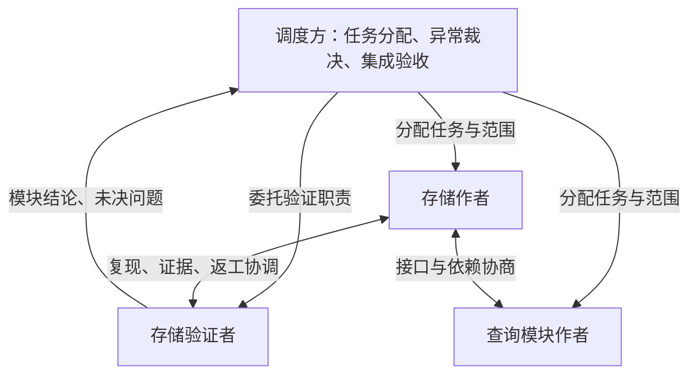

# 网状协作演进提案

记录日期：2026-09-23。核对基线：`c60134c`。
**状态：M0 成员发现已在实验分支实现，未合并 main；消息传输与 M1–M4 仍待实现。**
本页供项目规划，不是运行包的操作说明，也不要求每个 agent 加载全文。

实施顺序统一见[综合实施计划](IMPLEMENTATION-PLAN.md)，本页保留 M0–M4 的详细设计。
核对至 `c5c6f93` 的重新排期将 M0/M1 文件消息与短通知安排在最小共同基础之后，
不等待完整三级审批；短通知在独立实验分支验证，当前运行方式保持原状。共同基础的
开发实验工具已在后续提交实现；成员目录已在 `experiment/peer-notices` 的 `c5d3993`
实现，未合并 main。文件消息和通知传输仍未实现。

2026-09-24 最新方向：**允许受控打断造成工作暂停，由接收方在唤醒后检查并恢复原工作。**
状态判断用于减少干扰，不要求先证明绝对安全。具体恢复职责、报告核查和小批次顺序见
[判定层与通知恢复计划](DECISION-LAYER-FOLLOWUP.md)；本轮仅更新设计。
逐批实施现统一到[M1 执行明细](M1-IMPLEMENTATION-PLAN.md)：包含持久未读、防遗忘提醒、
收口竞态、可替换通知适配及 hcom 小型选择试验。hcom 仅为候选，尚未接入或安装。

后续以[DataHive 成本与质量复核](DATAHIVE-COST-QUALITY.md)约束优化顺序：独立验证有
实际检出价值，调度长会话也有可观测成本；先补计量、验收分工和阶段接班，再评估网状
交流的增量收益。接班可独立演进，不必等 M3/M4，也不预设新会话一定更省。

## 目标与当前起点

希望逐步支持两类工作：

1. 调度方忙于其他模块时，指定一个验证者，直接与模块作者沟通、复现、跟进返工，
   在明确授权下承担该模块验收；调度方接收结论和需要裁决的问题。
2. 模块 agent 查询其他模块的接口、约束或进度，并在既有任务范围内直接协调工作，
   不必把每次问答交给调度方转述。

已有机制和新增部分需要分清：

| 当前已有 | 仍需新增 |
|---|---|
| 作者、独立验证者、返工任务包；可并行准备验证夹具 | 跨宿主的成员发现、直接寻址、持久收件箱与会话状态 |
| 同机共享文件、成果引用、调度方转述 | 消息送达、读取、待回复、失效与恢复的共同语义 |
| job/round 身份、唯一活动轮、提交租约与 revision 检查 | 同伴协作与轮次推进的衔接、限定职责的委托 |
| 固定快照、独立验收、宿主收尾门禁 | 验证者持续协调作者、按授权记录特定版本的模块验收 |
| 只读 watch、持久待办与恢复摘要 | 未读消息的增量读取、处理责任和宿主能力适配 |

[生命周期参考](../skills/agent-orchestrator/references/lifecycle.md)明确说明当前没有
直接的 agent 间消息传输；[任务配方](../skills/agent-orchestrator/references/task-workflow.md)
已经支持独立验证，但沟通、返工推进仍主要由控制器串联。
某个宿主自带团队消息能力，不等于 kumi 已有跨宿主通道。

## 推荐模型：按需连接，责任明确

通信关系可以是网状，任务归属、依赖关系和控制权分别记录。
无需预先建立全连接网络；agent 按模块职责找到相关同伴，发起直接问答。



- **通信关系**回答“谁可以和谁讨论”。同一 run 中获准参与的 agent 可以按需直接沟通，
  无需每次让调度方同意或抄送全文。
- **任务归属**回答“谁负责产出、谁负责裁决”。每个任务有明确责任人；验收职责可以另行委托。
- **依赖关系**回答“哪件事真的阻塞工作”。聊天不自动生成依赖；实际等待才登记对象、版本、
  原因、期限和解除条件。
- **输入控制权**回答“谁能驱动这个终端和切换轮次”。同一目标同一时刻只有一个控制方。
  通信对象变多不增加终端写入者。

职责还要区分：业务负责人、输入控制方、监督负责人、验收负责人。
它们可以由同一 agent 承担，也可明确交接；不能因为添加了验证者，就默认权限巡视也有人接手。
未委托出去的责任仍由原负责人承担。

## 两个工作场景

### 验证者与作者直接协作

1. 调度方创建验证任务，提供作者身份、任务范围、验收标准版本、可读产物、
   可写的验证目录、预算以及需要升级的问题类型。验证者可先独立准备夹具。
2. 作者交接固定快照后，验证者针对该版本测试；发现问题直接发送缺陷与复现证据。
   作者直接解释、复现或提出修复方案，无须调度方复述。
3. 作者在仍开放且获准修改的轮次内，可以按原任务范围处理反馈。
   已发布有效结果的轮次保持不可变：任何返工、补答或结果纠正仍需新轮次，
   由该 job 的输入控制方按现有提交门槛推进。
4. 新快照对应新的验证证据。验证者能拒收不合格成果；已获模块验收授权时，
   可以对指定版本给出有效模块结论。没有这项授权时，产出验收建议。
5. 调度方接收模块结论及必要证据，处理规格争议、跨模块接口冲突和集成验收。
   模块通过不自动表示集成通过、宿主已停止，或所有后台活动已收尾。

第一步落地时可以先让作者和验证者直接交换信息，轮次切换继续由现有控制方执行。
这能减少转述，但仍有推进瓶颈。后续再让“限定范围的返工请求”进入受约束的调度入口，
或显式交接该 job 的输入控制权，才可能减少调度方逐轮介入。
不把“两个 agent 可以聊天”描述成“已经能自动完成验收返工闭环”。

### 两个模块一起工作

例如查询模块需要确认存储层的取消语义：先从成员目录找到存储负责人，发送具体问题、
所依据的接口版本与所需答复时间；对方直接回复约束和证据。双方可以在各自既有范围内
拆分修改、约定交接版本和集成检查。

双方确认的接口约定应形成简短、带版本的决策记录，由受影响方确认后采用；聊天中的
临时建议不自动覆盖任务契约。需要修改共同文件时，先明确唯一写入者或交接顺序，
其他参与者提供补丁建议、夹具或评审。跨 worktree 合并后重新运行相关集成门禁。
两边各自在不同副本通过测试，不表示组合版本已通过。

本地实现选择和已授权范围内的协作由参与者完成。改变外部规格、扩大写入范围、
调整共享接口且无法取得一致、放宽验收标准或追加预算时，交给相应负责人裁决；
不要求调度方批准每一句问答。

## 最小通信层

建议先做同机、同 run 的成员目录，而不是允许任意路径互发：

- 一条 run manifest 绑定 `member_id` 到 job/round、精确 agent/native 实例及入场/替换记录；
  `role` 与 `module` 描述职责，`responsibility` 给出短范围，`lifecycle` 表示 starting/active/
  idle/exited/replaced/unknown。控制、监督、验收负责人和 communication scope 单独登记。
- 查询可按模块、职责、状态和可见范围找人；返回短目录项和精确地址，不附会话全文。
  tab 名只方便人读，不作为寻址身份。成员退休或换实例后保留旧记录，并明确拒绝旧轮
  定向的新消息；跨轮消息须显式标记范围且接收方仍有效。
- 注册权限只允许受 run 授权的控制方；成员只能读取获授权目录字段和自己的消息状态。
  目录列出同伴不等于允许读对方 job 文件、租约、token 或日志。共享目录是合作约束，
  不是恶意进程隔离。

再做持久消息层，让四类宿主通过共同 helper 收发。
成员权限、角色选择、收发与读取语义不按宿主设置等级。Codex、omp、Hermes、OpenCode
都可承担调度、作者或验证职责；宿主类型/模式只是路由和能力证据元数据。终端通知按各自
已验证的能力适配，未知时保留队列；文件层不绑定某两个宿主。OMO/pure 分别记录覆盖。
不以修改宿主本体为前提；远程代理、跨 run 联邦与常驻网络服务留到后续。
任务包需明确授予必要的消息读写范围；成员目录与收件箱不暴露控制器租约 token、
其他任务的私密日志或未授权文件。共享通信所需资料不等于开放整个运行目录。

以下是数据职责草案，**不是可调用的 CLI 或已经确定的 JSON schema**：

| 记录 | 最少需要表达的事实 |
|---|---|
| 成员 | 稳定参与者/实例 ID、角色/模块及职责、所属 job/round、输入/监督/验收负责人、通信范围、生命周期/替换关系 |
| 消息 | run、唯一消息 ID、会话 ID、精确发送方/接收方、发送轮次与目标轮次或明确的跨轮范围、类型、时间、正文/证据引用 |
| 问题 | 关联消息、期望答复/截止时间、是否阻塞、负责回复的人、未决/已答复/已解决/过期/取消状态 |
| 决策 | 对应契约/接口版本、参与者确认、理由、适用范围与替代关系 |
| 委托 | 授予方、受托方、对象与允许动作、边界、预算、有效期、撤销与交接记录 |

首批消息只需要查询、答复、进度/交接通知、缺陷反馈和协作请求。
普通文本不能直接变成 shell 命令、原生批准、结果发布或新任务指令。
同伴提供的信息可用于原有任务，但不提升其指令权限或扩大接收方授权。

- 持久化成功、送达可读、接收方确认读取、问题已解决是不同事实。
  扫描摘要或保存屏幕不算问题解决；读取失败也不能返回“没有未读”。
- 消息与后续确认/纠正各自留痕。并发发送需原子写入，重试使用稳定幂等键，
  同键不同正文报冲突；接收方去重。不要承诺跨存储与宿主输入的端到端 exactly-once。
- 答复引用原问题，保留版本与证据。顺序依赖以明确引用表达，不只依赖墙钟时间；
  乱序、重复和接收方切轮时仍能解释归属。
- 不以 tab 标题作为地址；标题是 UX-01 的人类入口。路由须核对 run/job/round 等身份，
  不把发给旧轮或旧实例的指令静默投递到“当前最新”实例。
- 成员状态过期或实例不可达时明确显示未知；恢复时从持久记录和精确身份重建，
  不因一次未响应就启动替代 agent，也不让旧实例与新实例同时接收有副作用的工作。
- 整段终端转录默认不广播。摘要给出问题、短上下文、接口/证据引用；详细内容按需读。
  引用需可读且能定位版本，不能只给另一个 worktree 无法访问的未提交文件路径。

同机同用户共享文件系统下，身份字段和 helper 校验提供协议约束与审计，
不构成恶意进程隔离或密码学身份认证。现有租约也只约束索引操作，不能拦住绕过
工具的 herdr/tmux 输入。首版明确采用合作 agent 的信任模型；需要强制隔离时另做
访问控制和受控输入服务，不能把消息层包装成已经具备的安全边界。

## 消息何时被处理

### 用户明确的实验方向：短通知与接收方自主安排

2026-09-23 补充：后续在独立实验分支验证“文件正文＋herdr 终端短通知”。这里的
受控打断只为让接收方知道有消息，不意味着要求接收方立刻读取全文、回答问题或
切换业务任务。接收方根据优先级、短主题和当前工作自行决定何时处理。

建议通知形状如下；它是协议草案，不是已经可用的 CLI 或 shell 指令：

```text
[kumi 消息] 来自=存储验证者 优先级=普通 主题=取消接口确认 id=m-1042
```

完整消息、证据和回复关系存在收件箱文件中。发送方/接收方的实际身份仍绑定成员
记录和实例，显示名只帮助阅读；消息 ID 通过工具解析到已授权的文件，不在通知中
粘贴正文、任意执行指令、敏感参数或整段历史。短主题和显示字段按字面文本发送，
限制长度并处理换行及终端控制字符。

拟定流程：

1. 发送工具先原子保存正文与消息元数据，返回已入队；发送方继续自己的工作。
2. 唯一终端输入执行方根据状态和已约定的宿主策略选择通知机会。若需要中断，
   确认目标身份、范围与中断后输入就绪，再提交短通知并回车；已有排队／插入能力
   的宿主可做另一实验路径。普通消息也可以及时通知，不必等整个任务结束；
   是否读取全文仍由接收方决定。状态不明或处于审批界面时保留待投递，不盲发。
3. 接收方先检查原任务和未决工具：仍运行则关联/等待，已完成则读取结果，确认取消
   或失败后才按原授权续做；未知先核查，不直接重跑。随后可以立即读取消息；
   也可以确认已注意到、持久标记待处理，然后继续原工作。
   通知本身不要求生成一条“收到”的聊天回复，避免多一次无内容的往返。
4. 延后处理保留在持久收件箱状态中，不能只依赖接收方的会话记忆。接收方在工作
   检查点、涉及相关接口前或交付前重新查看待处理摘要；已知期限与阻塞关系单独
   跟踪，避免把“稍后查看”变成无限搁置。

2026-09-24 补充防遗忘约束：入队即建立未读责任；延期必须给出最迟检查时间，可另
绑定检查点，任一先到即到期。独立监督循环负责合并提醒、冷却和超期升级，不能只靠
接收方记忆；离线/预算耗尽仍保留 overdue 与负责人。通知 ACK 不等于正文已读，
部分读取不清除整条未读责任。关键消息按既定权限进入成功收口门禁，普通消息也须
显式处置/转交，不能静默遗忘。完整约束与故障测试见
[延期后不能遗忘](DECISION-LAYER-FOLLOWUP.md#延期后不能遗忘持久待办与到期处理)，尚未实现。

优先级首版建议为低／普通／高，用来帮助接收方安排顺序。高优先级可以建议下一个
合适检查点优先读取，但不自动取得终端中断、审批、取消或扩大任务范围的权限。
工具先保存发送方标注，接收方可反馈实际处理安排；具体映射和提醒间隔待实验决定。

状态分开记录：文件已保存、通知提交／提交不确定、接收方已注意、正文已读、延期、
已处理／已回复。延期可以发生在读全文前或之后；确认注意到通知不清除正文未读状态，
读过也不代表问题已解决。同一批积压可合并为一次摘要通知，保留各消息 ID；
接收方明确延期后，在约定检查点/检查时间到达或优先级／期限发生实质变化时重新
提醒；提醒有冷却和预算，超期则升级，不持续反复打断，也不将延期当作永久静音。

先做无模型的状态/工具/必要屏幕观察与恢复约定，可替换后端留作通知时机的辅助对照；
不把“日志没有未配对工具”当成完整执行状态，也不以此阻塞全部受控打断实验。
投递器仍需核对原生事实、新鲜度、输入控制权和实际动作回执。该判断不同于操作
审批判断，不复用同一阈值。验收重点是“收到通知→核查中断状态→自主处理或延期→
原任务正确接续”，记录中断损失、延迟、读消息与唤醒的 token；通知很短本身不能
证明影响很小。此处不宣称支持无损暂停／恢复。
中断损失可以被观测并接受；错对象输入、误审批、重复副作用不能记作通过。
接收方最小恢复结论独立于消息已读/解决，不要求每次生成长总结或调度方再审一遍。

这项实验仍归 M0/M1，不改变现有 result 不可变、按轮验收和控制回执。只更新设计，
后续已创建实验分支并实现成员发现；尚未启动投递器或替换当前通信方式。

实现前须区分通知与停止：当前 `controls.py` 的 confirmed interrupt 要求整个声明
范围满足 stopped 检查，而短通知可能保留自有后台工作。因此通知需要独立的投递和
交互恢复证据，不能假记 stopped 或降低现有取消门槛。详细先后条件见综合计划。

持久收件箱不会自行唤醒模型。设计须分别处理这些状态：

| 接收方状态 | 建议行为 |
|---|---|
| 正在执行、能继续调用工具 | 在任务切片边界、使用依赖前、交付前主动增量读收件箱；长工具调用期间不保证读取 |
| 原生宿主忙碌，支持已验证的通知/steering | 由唯一输入控制方使用对应适配；记录实际送达证据，不能仅凭发出命令认定已处理 |
| 宿主无相应能力或状态未知 | 消息保持待处理；监督方显示超期与可用性，按任务期限升级，不向忙碌终端盲发普通 prompt |
| 已发布结果、等待下一轮 | 保留消息，合并进下一次受控任务；需要答复时显式建立新轮次，不继续修改旧结果 |
| 等待原生权限审批 | 继续走审批事件的独立通道；普通聊天或“可以了”不能代替操作级授权 |
| 已取消、退出或被替代 | 拒绝新工作或返回不可用；保留旧消息，由负责人决定是否显式转交 |

检查点是合作约定，不能保证 agent 正在长时间思考时及时读取。
首版需暴露待处理时长及最后确认读取时间，实测各宿主边界后再承诺延迟。
有其他独立工作时继续推进；真正等待依赖时才进入有期限的等待，避免反复问“好了没”。
调度方摘要保留未决阻塞、权限请求、预算及异常，正常问答只需可追溯，毋须逐条加载。

## 委托验收与轮次控制

通信权限、模块验收权限、终端输入控制权分别授予，不能共用一个“大权限”。
委托应固定：目标模块/job、适用轮次或轮次范围、spec/oracle 版本、允许的返工类型、
可写范围、轮次/时间/成本预算，以及冲突升级路径。

模块验收结论绑定作者 job/round、交付快照、验证 attempt、oracle 和委托记录。
作者换了版本，旧结论仍是旧版本证据；不能沿用为新版本通过。
验证者自身交付的报告和夹具仍须满足其任务的验收要求，不能借作者的通过状态。
作者与验证者对标准有争议时保留双方依据，不能通过协商偷偷降低 oracle。

当前 `jobs.py` 的切轮、验收和关闭操作依赖同一 job 租约；没有独立的委托权限层。
因此首版验证者产出结论，由现有控制方记账。后续有两个可评估入口：

- 受约束的操作请求：受托者提交特定版本的验收或返工请求，由工具校验范围、预算和
  证据后交给唯一控制方执行；无需调度模型重新转述全部问题，但仍需实际执行者。
- 明确控制权交接：旧控制方停止输入、释放/到期并核对状态，新控制方获取独立租约，
  同时接续监督；同一时刻不保留两名输入控制方。

不把父控制器的租约 token 复制给验证者。首版不另起无人监督的守护进程，
不默认验证者获得审批、开更多 agent、关闭其他任务或合并发布的权限。
已明确委托的范围内可自行推进，超出范围才请求相应负责人。

## 失败、冲突与成本边界

- **互相等待**：登记真实阻塞依赖，检查 A 等 B、B 又等 A 的环及长时间无进展。
  到期限交给指定负责人重排工作或提供固定接口夹具；通信图本身有环是正常的。
- **并发写入与测试**：独立 worktree 或明确文件所有权，构建目录、端口、数据库等
  也要独立或登记占用。继续遵守快照交接，不因双方聊天协商过就跳过检查。
- **无限返工与消息风暴**：每个协作任务有限定往返、返工轮次、截止时间和预算。
  同一缺陷聚合到一个会话；超预算保留未决问题并升级，不默认再开一层 agent。
- **取消与撤销**：记录停止接收新工作、实际中断、停止确认和副作用核查。
  撤销后禁止新增授权动作，已开始动作需收尾；协作关系不自动变成子任务所有权，
  取消作者任务不能顺带杀死仍服务其他模块的同伴。
- **恢复**：重读持久消息、未决问题、委托与取消记录，核对当前身份、输入负责人和
  监督覆盖；禁止因消息重放重复启动返工、重复验收或重复审批。
- **成本**：默认定向消息、增量未读和按需证据，无全员历史广播；尽量保留模块本地
  上下文、复用已核实答复。额外验证者只在独立验证或减少关键路径等待有价值时创建。

token 总量须计入调度方、作者、验证者、消息读取、后台调用、重试、返工与恢复。
减少调度方转述不必然降低总量；频繁唤醒和重复上下文也可能更贵。
成本对照同时观察质量、墙钟时间、关键依赖等待、无效问答和消息处理延迟。
来源不完整时保留未知覆盖，不能用消息字节数推导净 token 节省。

## 分阶段落地与验收

M0 成员发现子项已有实验实现，其余设计和 M1–M4 仍待做；继续衔接[DataHive 跟进队列](DATAHIVE-FOLLOWUP.md)，
不替代当前 B 主线或已记录的 UX-01。

| 阶段 | 范围 | 进入与完成条件 |
|---|---|---|
| M0 协议设计 | 成员身份、会话/问题状态、委托边界、宿主读取能力表 | 成员发现已在独立分支通过夹具验证；待确定消息最小 schema、检查点与失败语义，并完成设计审阅 |
| M1 同伴问答 | 独立分支：先文件消息、增量收件箱、答复/注意/读取/延期/恢复，再短通知与接收方自主安排；不改变 job 控制权 | 验证并发、重复/乱序、崩溃恢复、错 run/轮次、读取失败、关闭接收方；四类宿主/五配置统一列入实际问答、延期后继续与按时重读矩阵，可分批异构配对，独立核对通知机会和中断损失 |
| M2 验证协作 | 作者↔验证者沟通，缺陷与证据交接，建议式验收；随后限定委托及返工推进 | 建立 DH-01 的按轮验收；执行委托前完成相关 DH-02/03 收口，落实 DH-07 的版本和资源约束 |
| M3 跨模块协作 | 接口决策、显式依赖、写入/测试占用、冲突与循环等待处置 | 两个模块直接协作并通过集成验收；取消、接管、过期消息不能造成重复副作用 |
| M4 选择性自治与对照 | 有预算的局部协调者、扩展 M1 通知能力与可选时机判断，以及集中式/网状协作成本对照 | 前述故障路径成立；接入 E，对同任务和同验收记录完整成本与覆盖，不先承诺全自治或净节省 |

DH-01 防止验收落到错误轮次；DH-02 支撑控制权交接、停止与取消；DH-03 防止
多个参与者混淆审批事件；DH-07 固定输入版本并协调共享资源。DH-04 的参数化
工作流可承接消息读取与轮次推进。M1 的限定问答原型不必等待所有 DataHive 待办完成，
但扩大到自动返工与委托控制前必须满足对应门槛。

首个小项目实验使用一个作者、一个验证者和仍在做独立工作的调度方，
故意放入一个可复现缺陷，观察直接问答、固定版本拒收、新轮修复、独立复验。
第二个实验再增加跨模块依赖；不一开始就搭建全连接团队。
两次均记录调度方是否仍需逐条转述、接管次数、过期/重复消息、权限响应和总成本。
确定性测试验证协议故障边界，真实异构宿主实验验证消息实际被读到；两者不能相互替代。

## 接入与兼容边界

首版优先以可选能力接入；既有不启用协作的任务照常使用 schema version 1。
实现前确定 sidecar 与 request 的精确绑定和独立版本，不静默给严格 schema 塞入字段。
仅在启用时给 agent 提供收发入口、成员摘要与必要规则；旧客户端遇到不支持的协作
契约要明确报错或降级为显式转述，不能表现为“已发送”却无人消费。

本提案中的消息实现尚未落地；开发实验基础已增加四宿主入口与覆盖矩阵，运行包和 skill 指令未变更；
不依赖个人 vault，不引入宿主本体补丁，也没有新增常驻服务或唤醒保证。
